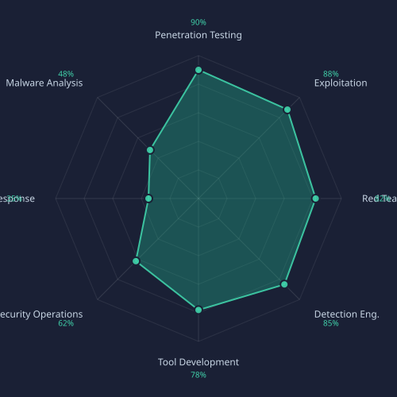

<div align="center">

<h1>Adrian Vinicius Ferreira Alves</h1>

<p>
  <a href="https://www.linkedin.com/in/adrian-alvesz/"></a>
  <a href="https://byteshift.com.br"></a>
  <a href="https://tryhackme.com/p/Sanityz"></a>
  <a href="https://app.hackthebox.com/users/51099"></a>
</p>

<p><strong>Detection Engineer · Security Researcher · Tool Developer · Founder @ ByteShift Atlas</strong></p>
<p><sub>São Paulo, SP — Brasil</sub></p>

</div>

---

### About

Cybersecurity professional with a background spanning both offensive and defensive security. Founder of **ByteShift**, a consulting practice and product company — currently building **ByteShift Atlas**, a multi-tenant SaaS SOC platform with multi-SIEM integration, SOAR automation, and MITRE ATT&CK-based detection.

Previously worked as **Endpoint Security Analyst at Santander Brasil** (via Motivus), operating CrowdStrike Falcon, Netskope, Cisco Umbrella, Trellix, Qualys and Splunk in a large-scale corporate environment.

Current focus is **offensive security** — red team operations, vulnerability analysis, exploitation, and building tools that bridge the gap between attack and defense.

---

### Skill focus areas

<div align="center">
  
</div>

---

### Tech stack

**Offensive Security**


**SIEM & Detection**


**Endpoint & Network Security**


**Cloud**


**Languages & Automation**


**Frameworks & Standards**


---

### Main project — ByteShift Atlas

> Multi-tenant SaaS SOC platform with multi-SIEM integration, SOAR automation, and MITRE ATT&CK-based detection engineering.

| | |
|---|---|
| **Stack** | Node.js · TypeScript · Fastify · Next.js · PostgreSQL · TimescaleDB |
| **Integrations** | Wazuh · Splunk · Microsoft Sentinel · Supabase |
| **Detection** | Custom engine — sliding window counters, webhook alerting, MITRE mapping |
| **Auth** | mTLS with Manager-operated CA for agent authentication |

---

### Certifications

| | Certification | Issuer |
|---|---|---|
|  | SC-200 Microsoft Security Operations Analyst | Microsoft |
|  | AWS Certified Cloud Practitioner | AWS · valid Aug 2026 |
|  | Jr Penetration Tester | TryHackMe · Aug 2024 |
|  | Junior Cybersecurity Analyst Career Path | Cisco · Jan 2024 |
|  | Ethical Hacker | Cisco · Jan 2024 |
|  | Endpoint Security | Cisco · Aug 2024 |
|  | Detection Engineering Course | SecDay · Feb 2025 |
|  | Cybersecurity Awareness CAPC | Certiprof · Aug 2024 |

---

### CTF & Hacking labs

```
TryHackMe    │  Top 3% global  ·  103+ rooms  ·  Jr Penetration Tester cert
Hack The Box  │  Rank: Hacker  ·  Easy: Silentium · Kobold · CCTV · WingData · Facts
```

Skills: recon · web exploitation · Linux privilege escalation · Active Directory · OSINT · exploit dev

---

### GitHub stats

<div align="center">


</div>

---

<div align="center">
<sub>Detection is an art. Every log tells a story — you just have to know how to read it.</sub>
</div>
